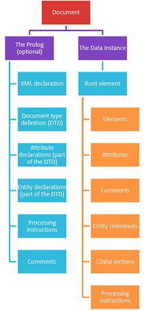

# Week 1

## Different types of data

Structured data
- It gives a proper view and u### Where can we use XML?
- Storing data
- Describing datahere can we use XML?
- Storing dataerstanding of the data.
- Stored in a tabular format (rows and columns).
- It can easily been searched by an algorithm (Where to look and what to compare).

Unstructured data
- No pre-defined structure.
- Data is irregular and ambiguous.
- Requires more storage.
- Provides a lot of information.
- Most of the available data is unstructured.

Semi-structured data
- It falls between structured and unstructured data.
- It is a combination of both.
- It has some organizational framework but does not have the complete structure that is required to fit in a relational database.
- Example: XML files.

## Metadata

Metadata is data that provides information about other data.
There are many distinct types of metadata, including:
- Descriptive metadata.
- Structural metadata.
- Administrative metadata.
- Statistical metadata.
- Legal metadata.

## Metadata Types 
- Descriptive metadata: It is used for discovery and identification. It includes elements such as (Who, What, Where, When). 
- Structural metadata: How compound objects are put together (the relationship with other objects). 
- Administrative metadata: Information to help manage a resource, like resource type, size, and when and how it was created. 
- Statistical metadata: also called process data, may describe processes that collect, process, or produce statistical data. 
- Legal metadata: provides information about the creator, copyright holder, and public licensing, if provided.
## ENCODING TEXT
Encoding is the process of turning characters into a coded representation.  
Some encodings use a single byte (eight bits) some use more.  
This limits how many characters you can encode
## ASCII
- Abbreviated from **American Standard Code for Information Interchange**. 
- It maps the decimal numbers from 0-127 to a character. 
- is a character encoding standard for electronic communication. 
- So it represents text in computers, telecommunications equipment, and other devices.
## Encoding (Unicode)
“Unicode provides a unique number for every character, no matter what the platform, no matter what the program and no matter what the language”
- Text encoding specification
- Designed to represent different languages with the same character set.
- Groups characters (ie letter, number, punctuation)
- Support includes Latin, Greek, Cyrillic, Armenian, Hebrew, Arabic, and Braille
- Version 11 supports over 137,000 characters
    - http://www.unicode.org/versions/Unicode11.0.0
- Code point is often expressed as U+hex number
    - i.e. U+0061 represents lowercase 'a'
## Unicode Transformation Format (UTF)
- 2 main encoding methods are UTF-8 and UTF-16
- In UTF-8, Unicode characters are encoded into bytes.
- UTF-8 uses a single byte to represent most (simple) characters, and can use up to4
- UTF-16 uses2 or more
- UTF-8 gives smaller files, UTF-16 tends to be easier to decode (as most characters use2 bytes).
## CSV / TSV files
- CSV = COMMA separated values. 
- TSV = TAB separated values. 
- Stores TABULAR data in plain text (usually with the file extension .csv or .tsv) 
- Data is stored in a plain text format that follows a structure. 
- Sometimes the first row contains a list of the field names (referred to as ‘headers’). 
- DELIMITED text files. 
- Encoded in same way as a text file.
## What is XML
Extensible Markup Language (XML): 
- Is a simple and a very flexible text format derived from SGML. 
- SGML (Standard Generalized Generic Markup Language): 
    the international standard for defining markup to describe the structure of different type of electronic documents. 
- XML is originally designed to meet the challenges of large-scale electronic publishing. 
- XML is also playing an increasingly important role in the storage and exchange of a wide variety of data on the Web and elsewhere.
## XML Versions
- Extensible Markup Language (XML) 1.0 (Fifth Edition) W3C Recommendation 26 November 2008
- Extensible Markup Language (XML) 1.1 (Second Edition)W3C Recommendation 16 August 2006, edited in place 29 September 2006
The World Wide Web Consortium (W3C) is an international community that develops open standards to ensure the long-term growth of the Web.
## Applications
Intellij IDEA
## Where can we use XML?
- Storing data
- Describing data
- Representing data
- Transforming data
- Transferring data
- Displaying data
## The Structure of an XML document

