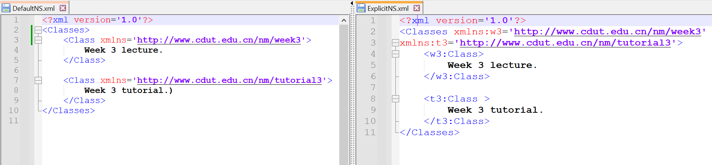
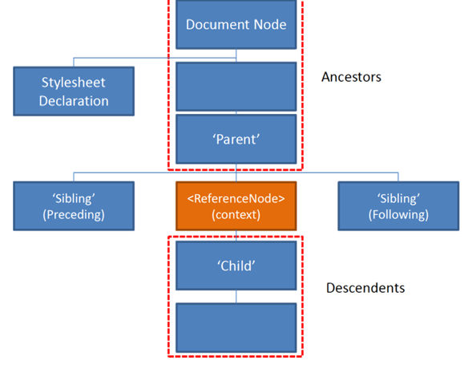
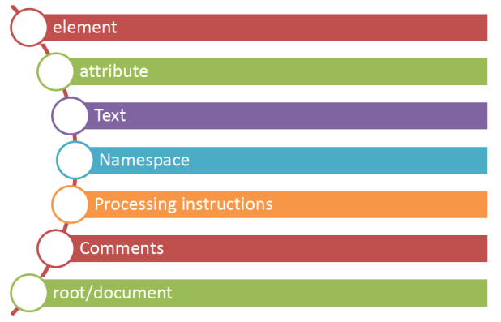
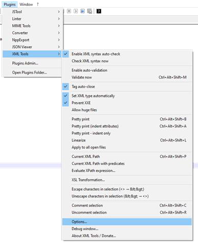
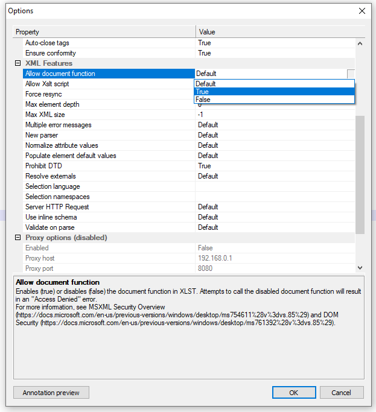
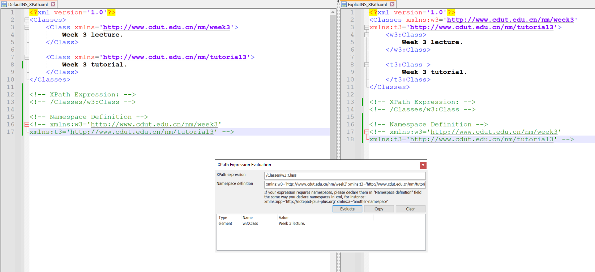
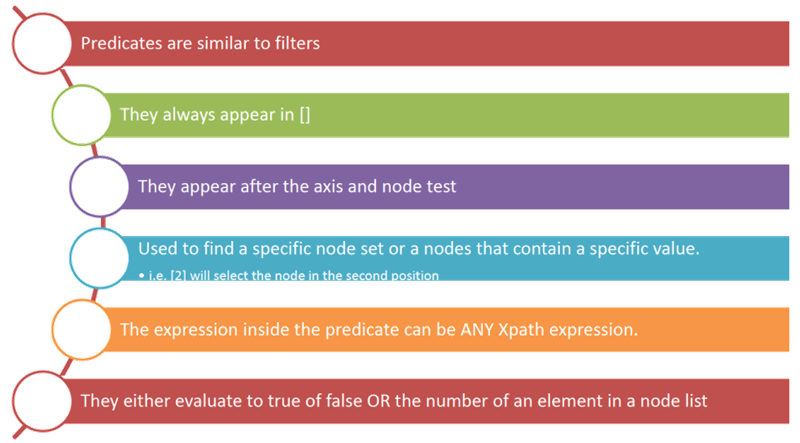

# Week 3 - XPATH

## Table of content
- Review Week2 Tutorial
- Look at some aspects of XML
- Namespaces
- Data Models
- Introduce XPath
- Look at some common XPath syntax

## Namespaces

- Allow us to group elements and attributes under a common heading.
- Namespaces are not parts of the XML specifications, but they are widely supported.

### Namespaces Declarations

```xml
<outerElement xmlns:events="URL" xmlns:graphics="URL">
```
- You can now use 'events' and 'graphics' prefixes:
```xml
<events:title>Content</events:title>
```
and
```xml
<graphics:title>Content</graphics:title>
```
- URL example: https://www.cdut.edu.cn/nm/week3

### Namespaces Types

| Default                                                                               | Explicit                                                        |
| ------------------------------------------------------------------------------------- | --------------------------------------------------------------- |
| - No prefix<br>- Namespace applies to every unqualified tag (a tag without a prefix). | - Utilizes a prefix.<br>- Shorthand notation for the namespace. |



## DOM

- Document Object Model (DOM):
    - Originally developed for HTML. Supported by most browsers.
    - Represents the content of the XML or HTML document as a tree structure.
    - Using DOM, we can easily read and update the contents of the document.


- Online DOM viewer: https://software.hixie.ch/utilities/js/live-dom-viewer/

## XPATH
- What is Xpath?
    - Allows us to use path expressions to navigate an XML document.
    - It allows us to select only the nodes we're interested in.
- So its:
    - Expression language.
    - Contains some standard functions.
    - Non-XML.
- XSLT relies heavily on the use of XPath to navigate a document, and find relevant nodes.

### XPATH Tree Structure
- Xpath works on the following kinds of nodes



> [!TIP]
> sibling: <正式>兄弟姐妹

### Using XPATH
- Xpath works on the following kinds of nodes



### Xpath paths (Absolute vs Relative)

| Absolute Location Path                                                                                                                                 | Relative Location Path                                                                                                                                                        |
| ------------------------------------------------------------------------------------------------------------------------------------------------------ | ----------------------------------------------------------------------------------------------------------------------------------------------------------------------------- |
| - If your location path starts with the root node or a forward slash (/) you are using an absolute location path<br>- e.g. `/bookstore/book[2]/author` | - If your location path begins with the name of a descendant, you're using a relative location path.<br>- Less complex than the absolute path.<br>- e.g. `//*/book[2]/author` |

### Xpath tools online
- https://www.easycodeforall.com/generate-xpath.html
- http://xpather.com/

### Preparing Notpad++



### Some key XPath expressions
- Xpath works on the following kinds of nodes

| Expression | Description                                                                                           |
| ---------- | ----------------------------------------------------------------------------------------------------- |
| _nodename_ | Selects all nodes with the name "_nodename_"                                                          |
| /          | Selects from the root node                                                                            |
| //         | Selects nodes in the document from the current node that match the selection no matter where they are |
| .          | Selects the value of the current node                                                                 |
| ..         | Selects the parent of the current node                                                                |
| @          | Selects attributes                                                                                    |

> [!NOTE]
> `*` 也作通配符，但会把所有元素一个一个地单列输出

### XPath Examples

| Path Expression | Result                                                                                                                                        |
| --------------- | --------------------------------------------------------------------------------------------------------------------------------------------- |
| bookstore       | Selects all nodes with the name "bookstore"                                                                                                   |
| /bookstore      | Selects the root element bookstore<br><br>**Note:**If the path starts with a slash ( / ) it always represents an absolute path to an element! |
| bookstore/book  | Selects all book elements that are children of bookstore                                                                                      |
| //book          | Selects all book elements no matter where they are in the document                                                                            |
| bookstore//book | Selects all book elements that are descendant of the bookstore element, no matter where they are under the bookstore element                  |
| //@lang         | Selects all attributes that are named lang                                                                                                    |

### Namespaces Xpath Examples


### Predicates


### Predicates examples

| Path Expression                    | Result                                                                                                                                 |
| ---------------------------------- | -------------------------------------------------------------------------------------------------------------------------------------- |
| /bookstore/book[1]                 | Selects the first book element that is the child of the bookstore element.                                                             |
| /bookstore/book[last()]            | Selects the last book element that is the child of the bookstore element                                                               |
| /bookstore/book[last()-1]          | Selects the last but one book element that is the child of the bookstore element                                                       |
| /bookstore/book[position()<3]      | Selects the first two book elements that are children of the bookstore element                                                         |
| //title[@lang]                     | Selects all the title elements that have an attribute named lang                                                                       |
| //title[@lang='en']                | Selects all the title elements that have a "lang" attribute with a value of "en"                                                       |
| /bookstore/book[price>35.00]       | Selects all the book elements of the bookstore element that have a price element with a value greater than 35.00                       |
| /bookstore/book[price>35.00]/title | Selects all the title elements of the book elements of the bookstore element that have a price element with a value greater than 35.00 |

**_Other Examples:_**  
`//Actor [@gender='male’]`  
`//Movie[2]/Top_Cast/Actor[@gender='male’]`  
`//Movie[2]/Top_Cast/Actor[last()]/.`  
*`//Actress[text()='Takayo Fischer’]`*  
*`/Movies/Movie[2]/Top_Cast/Actress [@gender='female'][last()-1]`*  

### XPATH Axes
- An Axes represents a relationship to the current node on the tree.

| AxisName           | Result                                                                                                                       |
| ------------------ | ---------------------------------------------------------------------------------------------------------------------------- |
| ancestor           | Selects all ancestors (parent, grandparent, etc.) of the current node                                                        |
| ancestor-or-self   | Selects all ancestors (parent, grandparent, etc.) of the current node and the current node itself                            |
| attribute          | Selects all attributes of the current node                                                                                   |
| child              | Selects all children of the current node                                                                                     |
| descendant         | Selects all descendants (children, grandchildren, etc.) of the current node                                                  |
| descendant-or-self | Selects all descendants (children, grandchildren, etc.) of the current node and the current node itself                      |
| following          | Selects everything in the document after the closing tag of the current node                                                 |
| following-sibling  | Selects all siblings after the current node                                                                                  |
| namespace          | Selects all namespace nodes of the current node                                                                              |
| parent             | Selects the parent of the current node                                                                                       |
| preceding          | Selects all nodes that appear before the current node in the document, except ancestors, attribute nodes and namespace nodes |
| preceding-sibling  | Selects all siblings before the current node                                                                                 |
| self               | Selects the current node                                                                                                     |

### XPATH Axes Examples

| AxisName          | Example                                                              |
| ----------------- | -------------------------------------------------------------------- |
| ancestor          | //Actor/ancestor::*                                                  |
| ancestor-or-self  | //Actor/ancestor-or-self::*                                          |
| attribute         | //Actor/attribute::gender                                            |
| child             | //Top_Cast/child::Actor[text()='Will Smith’]<br>//Movie/child::*     |
| descendant        | //Movie/descendant::*                                                |
| following-sibling | //Actor [text()='Will Smith']/following-sibling::Actress             |
| parent            | //Actor [text()='Will Smith']/parent::*                              |
| self              | //Actor/self::*                                                      |