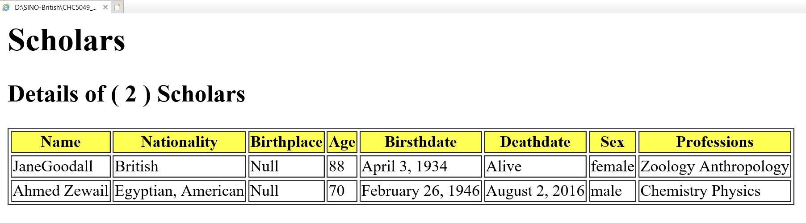

# XPath/XSLT

**Considering the Scholars XML code from last week's tutorial:**  
Exercise 1 – Express the following XPath <mark>Axes</mark> queries:

- The ID of all scholars.
  - `//attribute::SID`
- The nationality of the second scholar.
  - `//Scholar[2]/child::Nationality`
  - `//Scholar[2]/Nationality/self::*`
- The sex of scholars who are alive.
  - `//Scholar/Age[attribute::Status="Alive"]/ancestor::*/Sex`
- Using the relative location path, retrieve the first profession of all scholars.
  - `//Profession[1]/self::*`
- The ID of all-male scholars.
  - `//Sex[text()="Male"]/parent::*/attribute::SID`
- All attributes of the scholar age.
  - `//Age/attribute::*`

Exercise 2 – Derive a full XSLT document to have an output similar to the following:


参考答案：

```xml
<xsl:stylesheet version="1.0" xmlns:xsl="http://www.w3.org/1999/XSL/Transform">  
    <xsl:output method="html" indent="yes"/>  
    <xsl:template match="/">  
        <html>  
            <head>  
                <title>Scholars List</title>  
            </head>  
            <body>  
                <h1>Scholars</h1>  
                <h2>Details of (  
                    <xsl:value-of select="count(Scholars/Scholar)"/>  
                    ) scholars  
                </h2>  
                <table border="2">  
                    <tr bgcolor="yellow">  
                        <th>Name</th>  
                        <th>Nationality</th>  
                        <th>Birthplace</th>  
                        <th>Age</th>  
                        <th>Birthdate</th>  
                        <th>Deathdate</th>  
                        <th>Sex</th>  
                        <th>Professions</th>  
                    </tr>  
                    <xsl:for-each select="Scholars/Scholar">  
                        <tr>  
                            <td>  
                                        <xsl:value-of select="Fullname"/>  
                                        <xsl:value-of select="concat(Firstname, ' ', Lastname)"/>  
                            </td>  
                            <td><xsl:value-of select="Nationality"/></td>  
                            <td>  
                                <xsl:if test="Birthplace=''">  
                                    <xsl:text>Null</xsl:text>  
                                </xsl:if>  
                                <xsl:value-of select="Birthplace"/>  
                            </td>  
                            <td><xsl:value-of select="Age"/></td>  
                            <td><xsl:value-of select="Age/@Birthdate"/></td>  
                            <td>  
                                <xsl:choose>  
                                    <xsl:when test="Age/@Deathdate">  
                                        <xsl:value-of select="Age/@Deathdate"/>  
                                    </xsl:when>  
                                    <xsl:otherwise>  
                                        <xsl:text>Alive</xsl:text>  
                                    </xsl:otherwise>  
                                </xsl:choose>  
                            </td>  
                            <td><xsl:value-of select="Sex"/></td>  
                            <td>  
                                <xsl:for-each select="Professions/Profession">  
                                    <xsl:value-of select="."/>  
                                    <xsl:if test="position() != last()">  
                                        <xsl:text>, </xsl:text>  
                                    </xsl:if>  
                                </xsl:for-each>  
                            </td>  
                        </tr>  
                    </xsl:for-each>  
                </table>  
            </body>  
        </html>  
    </xsl:template>  
</xsl:stylesheet>
```
