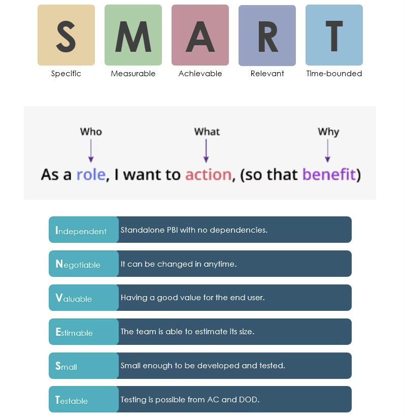

# Week 2

## The Journey from Idea to Value
#### Sources of Innovative Product Ideas
- Discovering unmet user needs
- 发现未满足的用户需求
- Identifying inefficient processes
- 识别效率低下的流程
- Improving existing products with poor user experience
- 改善现有用户体验差的产品
- Analyzing market trends and competitors
- 分析市场趋势和竞争对手
Innovative ideas do not emerge from thin air, but rather from a deep insight into problems and opportunities.  
创新思想不是凭空产生的，而是对问题和机遇的深刻洞察。

### User Stories: The Smallest Deliverable Unit of Requirements
"A user story is a way of describing software functionality from the user's perspective, focusing on user value rather than a pure list of features."  
“用户故事是从用户的角度描述软件功能的一种方式，它关注的是用户价值，而不是纯粹的功能列表。”

| Classic Template                                                               | Example 1                                                                                                                                                     | Example 2                                                                                                                                                        |
| ------------------------------------------------------------------------------ | ------------------------------------------------------------------------------------------------------------------------------------------------------------- | ---------------------------------------------------------------------------------------------------------------------------------------------------------------- |
| As a \[User Role\], I want to \[Some Feature\], So that \[Achieve Some Value\] | As a **student**, I want to **see my learning progress bar on the course page**, so that **I can clearly understand my learning status and motivate myself.** | As a **teacher**, I want to **be able to export all students’ assignment grades with one click**, so that **I can quickly complete grade statistics and entry.** |
### Use Popular Frameworks – SMART and INVEST

#### SMART

| 1. Specific                                                                                                                    | 2. Measurable                                                                                      | 3. Achievable                                                                           | 4. Relevant                                                                                               | 5. Time-bound                                                           |
| ------------------------------------------------------------------------------------------------------------------------------ | -------------------------------------------------------------------------------------------------- | --------------------------------------------------------------------------------------- | --------------------------------------------------------------------------------------------------------- | ----------------------------------------------------------------------- |
| The user story clearly defines what the user wants to achieve – booking a hotel room online. 用户故事清楚地定义了用户想要实现的目标——在线预订酒店房间。 | The user story can be measured by the time and effort saved by the user. 用户故事可以通过用户节省的时间和精力来衡量。 | The user story is achievable within a given timeline and budget. 用户故事可以在给定的时间和预算内实现。 | The user story is relevant to the user’s needs and goals as a frequent traveler. 用户故事与经常旅行的用户的需求和目标相关。 | The user story has a clear timeline for completion. 用户故事有一个清晰的完成时间表。 |

### Core Principles
#### 3C Principle
- **Card:** Concise writing on cards
- 卡片：卡片上简明的文字
- **Conversation:** The story is the beginning of the discussion, not the end
- 对话：故事是讨论的开始，而不是结束
- **Confirmation:** Definition of Done
- 确认：完成的定义
#### INVEST
- **I**ndependent 独立的
- **N**egotiable 可协商的
- **V**aluable 有价值的
- **E**stimable 可估计的
- **S**mall 小的
- **T**estable 可测试的
## Requirements Elicitation: The Bridge from User to Product Manager
"User stories are a good way to describe requirements, but how do you find these user stories?  
This requires effective requirements elicitation methods."  
“用户描述是描述需求的好方法，但是你如何找到这些用户描述呢？  
这就需要有效的需求提取方法。”  

| Interviews                                                                                                    | Focus Groups                                                                      | Surveys                                                                                                                                                                                                    |
| ------------------------------------------------------------------------------------------------------------- | --------------------------------------------------------------------------------- | ---------------------------------------------------------------------------------------------------------------------------------------------------------------------------------------------------------- |
| In-depth one-on-one conversations to gain detailed insights and deep motivations. 深入的一对一对话，以获得详细的见解和深刻的动机。 | Group discussions to gather collective opinions and consensus. 小组讨论，收集集体意见和共识。 | Collect data quickly on a large scale, suitable for quantitative analysis.  Tips: Clear questions, mainly multiple-choice, avoid ambiguity.  快速、大规模地收集数据，适合定量分析。  提示：题目清晰，以选择题为主，避免模棱两可。 |

### More Ways to Get Requirements

| Observation                                                                                                                                                                                                    | Competitor Analysis                                                                        | Prototyping Method                                                                                                                                                                                           |
| -------------------------------------------------------------------------------------------------------------------------------------------------------------------------------------------------------------- | ------------------------------------------------------------------------------------------ | ------------------------------------------------------------------------------------------------------------------------------------------------------------------------------------------------------------ |
| Directly observe user behavior in real-world environments to discover potential needs. Suitable for determining what users "do" rather than what they "say." 在现实环境中直接观察用户行为，发现潜在需求。适合于确定用户“做”什么，而不是他们“说”什么。 | Learn from competitor products to identify opportunities and gaps. 从竞争对手的产品中学习，找出机会和差距。 | Quickly build low-fidelity or high-fidelity prototypes and gather feedback through user trials. Emphasizes early validation of ideas and reduction of rework. 快速构建低保真度或高保真度原型，并通过用户试验收集反馈。强调想法的早期验证和减少返工。 |
## Product Requirements Classification and Management

| Functional Requirements                                                                       | Non-functional Requirements                                                                                                      | Business Requirements                                                                                    | User Requirements                                                        |
| --------------------------------------------------------------------------------------------- | -------------------------------------------------------------------------------------------------------------------------------- | -------------------------------------------------------------------------------------------------------- | ------------------------------------------------------------------------ |
| What the product "does", such as login, payment, and search functions 产品“做什么”，比如登录、支付和搜索功能 | How well the product "Performs" in terms of performance, security, usability, and maintainability 产品在性能、安全性、可用性和可维护性方面的“表现”如何 | High-level goals, such as improving user retention and reducing operating costs 高级目标，例如提高用户留存率和降低运营成本 | User goals, such as "I want to easily find courses" 用户目标，比如“我想轻松找到课程” |
Requirements management includes: Requirements tracking, Change management, Prioritization  
需求管理包括：需求跟踪、变更管理、优先级划分
## PMBOK Knowledge Areas

| Stakeholder Performance Domain                                                                                                                                                                                                                                                                                                                                                                                                     | Delivery Performance Domain                                                                                                                                                                                                                                                                                                                                                                                                                                                 |
| ---------------------------------------------------------------------------------------------------------------------------------------------------------------------------------------------------------------------------------------------------------------------------------------------------------------------------------------------------------------------------------------------------------------------------------- | --------------------------------------------------------------------------------------------------------------------------------------------------------------------------------------------------------------------------------------------------------------------------------------------------------------------------------------------------------------------------------------------------------------------------------------------------------------------------- |
| "Understanding stakeholder needs" is the cornerstone of project success. The requirements gathering process involves effective communication with stakeholders to identify and analyze their expectations and needs.  Product managers need to identify all key stakeholders and manage their involvement and expectations.  “理解涉众的需求”是项目成功的基石。需求收集过程包括与涉众的有效沟通，以识别和分析他们的期望和需求。  产品经理需要识别所有关键的利益相关者，并管理他们的参与和期望。 | The outcome of "delivery" is a product or service built based on "requirements." Requirements are the input for delivery, and the clarity and accuracy of these requirements directly impact the quality and efficiency of the delivery.  User stories and agile methodologies emphasize small, rapid iterations and continuous delivery of valuable features.  “交付”的结果是基于“需求”构建的产品或服务。需求是交付的输入，这些需求的清晰度和准确性直接影响交付的质量和效率。  用户故事和敏捷方法强调小而快速的迭代和持续交付有价值的特性。 |
## Summary
Discover pain points -> Writing User Stories -> Obtain Requirements -> Categorization Management -> Related to PMBOK