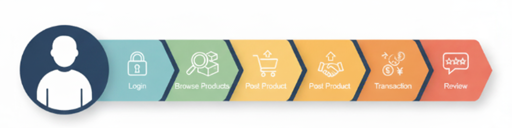

# Detailed Requirements and Product Vision<br>User Story Mapping and Product Backlog

## Learning Objectives

### Mastering User Story Mapping Construction Method

Understanding its role in visualizing and organizing requirements  
理解它在可视化和组织需求中的作用

### Learn Requirements Refinement

Further refine user stories into an executable list of features  
进一步将用户描述细化为可执行的特性列表

### Understanding the Product Backlog

Grasping its Composition, Prioritization, and the Importance of Continuous Refinement  
把握其构成、优先顺序和持续精细化的重要性

### Develop a Product Vision

Able to formulate a clear, inspiring product vision and understand its guiding role in product direction  
能够制定一个清晰的，鼓舞人心的产品愿景，并理解其在产品方向上的指导作用

## Part1: Introduction - From "Stories" to a Global Perspective of "Maps"

> "User story maps provide a global perspective, helping us see the user journey, identify missing features, and plan releases."  
> “用户故事地图提供了一个全局视角，帮助我们看到用户的旅程，识别缺失的功能，并计划发布。”

## Part2: Building User Story Mapping

> "A user story map is a visualization tool that presents the complete picture of a product by sorting and organizing user stories according to the user journey."  
> “用户故事地图是一种可视化工具，通过根据用户旅程对用户故事进行分类和组织，呈现产品的全貌。”

Core Idea:  核心理念：  
"Backbone" (User Activities/Main Tasks) → "Walking" (User Steps) → "Stories" (User Stories) → "Slices" (Releases)  
“主干”（用户活动/主要任务）→“行走”（用户步骤）→“故事”（用户故事）→“切片”（发布）

---

### Building Steps (with Examples)

#### Step One: Identify User Activities / Backbone

"What major stages or main activities do users experience when using the product?"
“用户在使用产品时经历了哪些主要阶段或主要活动？”

- For example: Login, Browse products, Post products, Transactions, Reviews, etc.
- 例如：登录、浏览产品、发布产品、交易、评论等。



#### Step Two: Refine User Steps / Walking Skeletons

Under each activity, what specific steps does the user perform?  
在每个活动下，用户执行哪些具体步骤？  

- For example, under "Browse products": "Search products." "View product details," "Add to cart." etc.
- 例如，在“浏览产品”下：“搜索产品”。“查看产品详细信息”、“添加到购物车”等。

#### Step Three: Populate User Stories

For each user step, write specific, independent, and valuable user stories  
对于每个用户步骤，编写具体的、独立的、有价值的用户故事  

> **As an** instructor,  
> 作为一名教师，  
> **I want to** create a new programming assignment with a detailed problem description, a code template for students to start with, and a set of hidden test cases for automated grading.  
> 我想创建一个新的编程作业，其中包含详细的问题描述，一个供学生开始使用的代码模板，以及一组用于自动评分的隐藏测试用例，  
> **So that** I can provide a structured learning activity and ensure fair, consistent evaluation.  
> 这样我就可以提供一个结构化的学习活动，并确保公平、一致的评估。

#### Step Four: Identify Releases / Slices

1. Draw lines on the map to slice stories into different releases (MVP, V1.0, V2.0, etc.)  在地图上绘制线条，将故事划分为不同的版本（MVP、V1.0、V2.0等）。
2. **Emphasize**: MVP (Minimum Viable Product) is the first slice of the story map, containing the most core stories that can validate value  强调：MVP（最小可行产品）是故事地图的第一部分，包含了能够验证价值的最核心的故事

### Value of User Story Maps

- ✅ Provides a global view, avoiding omissions
- ✅提供全局视图，避免遗漏
- ✅ Promotes team understanding of the user journey and product goals
- ✅促进团队对用户旅程和产品目标的理解
- ✅ Helps plan releases and priorities
- ✅帮助计划发布和优先级
- ✅ Facilitates communication and alignment
- ✅促进沟通和协调

## Part 3: Transforming Requirements into Executable Feature Lists and Product Backlog

### From User Stories to Features

- "User stories are from the user's perspective; features are from the development team's perspective."
- “用户故事是从用户的角度出发的；功能是开发团队的观点。”
- "A feature may consist of multiple user stories, or a user story may be a specific implementation of a feature."
- 一个功能可以由多个用户故事组成，或者一个用户故事可以是一个功能的具体实现。
**For example**: The user story "As a student, I want to see my learning progress bar on the course page" might correspond to a "Learning Progress Management" feature.  
例如：用户故事“作为一名学生，我想在课程页面上看到我的学习进度条”可能对应于“学习进度管理”功能。

### Product Backlog

#### Definition

"The product backlog is an ordered list of all known requirements for a product, and it is the sole source of product development."  
产品待办事项列表是一个产品所有已知需求的有序列表，它是产品开发的唯一来源。

#### Composition

User stories, defects, technical debt, new features, optimization items, etc.  
用户故事、缺陷、技术债务、新特性、优化项等等。

#### DEEP Principle

<table>
    <tbody>
        <tr>
            <td>Detailed appropriately<br>适当详细</td>
        </tr>
        <tr>
            <td>Estimated<br>估计的</td>
        </tr>
        <tr>
            <td>Emergent<br>新兴的</td>
        </tr>
        <tr>
            <td>Prioritized<br>按重要性排列</td>
        </tr>
    </tbody>
</table>

### Prioritization

- **Factors to Consider**: Value/benefit, cost/effort, risk, dependencies
- 需要考虑的因素：价值/收益，成本/努力，风险，依赖性
- **Methods**:
  - MoSCoW (Must have, Should have, Could have, Won't have)
  - MoSCow（一定有，应该有，可能有，不会有）
  - Weighted Shortest Job First (WSJF)
  - 加权最短作业优先 (WSJF)

### Backlog Refinement

The product backlog is not static; it requires continuous discussion, refinement, estimation, and prioritization by the product manager and the team.  
产品待办事项列表不是静态的；它需要产品经理和团队进行持续的讨论、细化、评估和确定优先级。  
Tools:  
Jira, Trello, Asana  


## Part 4: Product Vision

A product vision is a long-term, ambitious, and inspiring description of the product's future state.  
产品愿景是对产品未来状态的长期的、雄心勃勃的、鼓舞人心的描述。  
It answers two core questions: **"Why are we building this product?"** and **"What do we want this product to ultimately become?"**  
它回答了两个核心问题：“我们为什么要开发这个产品？”以及“我们希望这个产品最终成为什么？”  
**Role**: Provides direction and cohesion for the team, guiding all decisions.  
角色：为团队提供方向和凝聚力，指导所有决策。  

### Product Vision Statement Template

Geoffrey Moore's Template:

```
For [target customer]
针对[目标客户]
Who [has a certain need or pain point]
谁[有某种需要或痛点]
The [product name] is a [product category]
[产品名称]是一个[产品类别]
That [key benefit/problem solved]
[关键利益/问题解决了]
Unlike [main competitor]
不像[主要竞争对手]
Our product [core differentiated advantage]
我们的产品[核心差异化优势]
```

"For urban residents seeking convenient transportation, Who are tired of traffic jams and parking difficulties, The Uber is an on-demand ride-hailing service, That connects passengers and drivers via a mobile app, providing a convenient and efficient travel experience. Unlike traditional taxis, Our product offers more flexible dispatching, more transparent pricing, and more personalized service."  
“对于那些厌倦了交通拥堵和停车困难的城市居民来说，优步是一种按需叫车服务，通过移动应用程序连接乘客和司机，提供方便高效的出行体验。与传统出租车不同，我们的产品提供更灵活的调度、更透明的定价和更个性化的服务。”

## Part 5: Relating to PMBOK Knowledge Areas

### Planning Performance Domain

- "Requirement refinement" and "product backlog construction" are core planning processes
- “需求细化”和“产品待办事项列表构建”是核心计划过程
- PMBOK emphasizes planning through iterative and incremental approaches, which aligns with the continuous refinement of the product backlog in agile
- PMBOK强调通过迭代和增量方法进行计划，这与敏捷中产品待办事项列表的持续细化相一致
- User story maps are also a visual planning tool
- 用户故事地图也是一种视觉规划工具

### Delivery Performance Domain - Scope Definition

- User story maps and product backlogs jointly define the "scope" of the product
- 用户故事图和产品backlog共同定义了产品的“范围”
- The Delivery Performance Domain focuses on how to effectively deliver value, and clearly defined requirements (through story maps and backlog) are a prerequisite for effective delivery
- 交付性能领域关注于如何有效地交付价值，而明确定义的需求（通过故事图和待办事项）是有效交付的先决条件

### Strategic Artifacts

- **Product Vision Statement**: A key strategic artifact that guides product direction and ensures alignment with organizational strategy
- 产品愿景声明：指导产品方向并确保与组织战略保持一致的关键战略工件
- **Roadmap**: The slices (Releases) of the user story map can be seen as the preliminary form of a product roadmap, showing the product's delivery plan at different stages
- 路线图：用户故事图的切片（发布）可以看作是产品路线图的初步形式，显示了产品在不同阶段的交付计划
