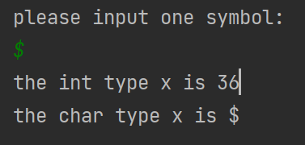

# Week 3 - Pointers & Structured Data

> [!NOTE]
> `int`占用4Bytes  
> 指针占用：  
> 64位芯片：64bits(8Bytes)  
> 32位芯片：32bits(4Bytes)  

## Table of content

- What is Pointer
- What is Structure
- Function `malloc()` and `free()`
- Dynamically allocate memory for array or structure

## Basic declarations

- Technically every variable declaration works like this.
- 从技术上讲，每个变量声明都像这样工作。

```c
uint32_t val;
```

- Allocates memory equal to the size of a `uint32` (4 bytes), and then tells the compiler to treat <span style="color: red">val</span> as reading the value at the allocated address.
- 分配与 uint32（4 字节）大小相等的内存，然后告诉编译器将 val 视为读取分配地址的值。
- As we saw last week you can find the address by writing `&val`.
- 正如上周我们所见，你可以通过写入`&val`来找到地址。

---

- The method of memory allocation is different between operating systems.
- 操作系统之间的内存分配方法不同。
- On older or embedded machines, the compiler might simply pick an address that it hasn’t used yet.
- 在较老或嵌入式机器上，编译器可能会简单地选择一个尚未使用的地址。
- On modern multitasking machines the compiler may have to add machine code to ask for memory from the operating system. (Or, more commonly, it will ask for a block of memory as the program starts, then pick unused areas within it.)
- 在现代多任务机器上，编译器可能需要添加机器代码来向操作系统请求内存。（或者，更常见的是，程序启动时会请求一块内存，然后从中选择未使用的区域。）

## Declaring pointers

- You can also directly declare variables to hold addresses, but this must be done carefully.
- 更常见的是，您也可以直接声明变量来存储地址，但必须谨慎操作。
- `uint32_t *pointer;` creates a variable that will hold an <span style="color: red">address</span> and tells C that when this address is used, its content should be interpreted as a `uint32`.
- 创建一个将存储地址的变量，并告诉 C 语言当使用此地址时，其内容应被解释为 uint32。

---

- <span style="color: red">Beware! Directly declaring a pointer does not allocate a uint32_t for it to point to, and it does not store any address in the pointer variable!</span>
- <span style="color: red">小心！直接声明指针并不会为它分配一个 uint32_t 来指向，也不会在指针变量中存储任何地址！</span>
- Writing `*pointer` will get a random address to `pointer`. This will read garbage data. If you write to it, your program will probably crash.
- 编写 `*pointer` 将会得到一个随机的地址赋给指针。这将读取垃圾数据。如果你向其写入，你的程序可能会崩溃。
- On older machines you will corrupt random memory.
- 在旧机器上，你将破坏随机内存。
- On newer OSs, the OS will detect that your program is trying to write random memory and crash it (“memory access violation” or “segmentation fault”)
- 在新操作系统上，操作系统将检测到你的程序正在尝试写入随机访问内存并使其崩溃（“内存访问违规”或“段错误”）

---

```c
int32_t *a;
uint8_t *b;
int64_t *c;
char *d;
double *e;
float *f;
```

> [!IMPORTANT]
> 不同芯片（64位/32位）中，占用的内存大小不同  
> 64位(bit): 8bytes  
> 32位(bit): 4bytes  

- All of these variables are allocated the same amount of space in memory: the size of an <span style="color: red">address</span>.
- 所有这些变量在内存中分配相同大小的空间：一个地址的大小。
- No matter what the declared type of a pointer is, it is always <span style="color: red">an unsigned int</span> that holds a memory address. The declared type tells C how to interpret the value it finds when it follows (dereferences) the pointer.
- 无论指针声明的类型是什么，它始终是一个包含内存地址的无符号整型。声明的类型告诉 C 如何解释它跟随（取消引用）指针时找到的值。
- All of these pointers will point to nothing and will cause errors if they are used without initiation.
- 所有这些指针都将指向空，如果在不初始化的情况下使用它们，将会导致错误。
type cast 类型转换

> 思考：能否使用类型转换，是否会出现问题

  



## Assigning pointers: Transmit

- On a modern system there are <span style="color: red">two ways</span> to get an address value to store in a pointer variable.
- 在现代系统中，有两种方法可以将地址值存储在指针变量中。
- <span style="color: red">One is</span> to use the address of an existing variable:
- 一种方法是使用现有变量的地址：

```c
int32_t x = 20;
int32_t *ptr = &x;
```

- In this case, the first declaration will allocate the memory for x. The second declaration will get the address of x and store it in the pointer, so `*ptr` will now access x.
- 在这种情况下，第一个声明将为 x 分配内存。第二个声明将获取 x 的地址并将其存储在指针中，因此`*ptr`现在将访问 x。
- This is what we used to allow transput parameters. But it is less useful in other circumstances, since inside the declaring function we can always refer to x instead.
- 这是我们用来允许传输参数的方式。但在其他情况下，它不太有用，因为在声明函数内部，我们总是可以引用 x。

## Assigning pointers: Dynamic

- <span style="color: red">The second</span> is to allocate memory ourselves:
- 第二个是自行分配内存：

```c
int32_t *x = (int32_t*) malloc(sizeof(int32_t));
```

- The `malloc` function tells the compiler to write any necessary machine code to allocate a block of memory of the size we specify, then return the address of that memory.
- `malloc` 函数告诉编译器编写必要的机器代码来分配我们指定大小的内存块，然后返回该内存的地址。
- The `malloc` function allocates <span style="color: red">an appropriate and anonymous block</span> of memory.
- `malloc` 函数分配一个适当且匿名的内存块。

> `malloc`: memory allocate

> [!IMPORTANT]
> Manual way

## Assigning pointers

- We use malloc together with sizeof to allocate the correct amount of memory for an `int32`. We know that it is 4 bytes, so it would be perfectly legal to write `malloc(4)`, but it is more readable and safer to use `sizeof()`.
- 我们使用 `malloc` 与 `sizeof` 一起为 `int32` 分配正确的内存量。我们知道它是 4 字节，所以写`malloc(4)`是完全合法的，但使用`sizeof()`更易读且更安全。
- We can then use `*x` freely to access this allocated memory as an `int32`.
- 然后我们可以自由地使用`*x`来访问这块分配的内存作为`int32`。
- So we can write `*x = 123`; There will be no error, since the memory has been allocated.
- 因此我们可以写`*x = 123;`由于内存已经被分配，所以不会有错误。

> Do you remember the same declaration in week2 PPT, which doesn’t work at that time
> 你还记得 week2 PPT 中的相同声明吗？当时它不起作用

---

This syntax is used in basic C:  
在基本 C 语言中，使用以下语法：  

```c
int32_t *x = (int32_t*) malloc(sizeof(int32_t));
```

- <span style="color: red">Thinking question</span>
  - C can’t accept a dynamic size array before C99(ISO);
  - C 语言在 C99（ISO）之前不能接受动态大小的数组；
  - Please use `malloc` to define a dynamic size array;
  - 请使用 `malloc` 来定义动态大小的数组；

```c
int *p;
p = (int *) malloc (n*sizeof(int));
```

> `n` is a variable, can be assigned a specific value
> `n` 是一个变量，可以被分配一个特定的值

## Manual memory allocation: Release

- When you allocate memory this way, you <span style="color: red">override</span> all of the compiler’s memory management.
- 当你这样分配内存时，你会覆盖编译器的所有内存管理。
- In particular, the compiler will no longer check <span style="color: red">scope</span> of variables you allocate this way.
- 特别是，编译器将不再检查你这样分配的变量的作用域。
- It is your responsibility to release the memory when you are done with it.
- 在你完成使用后，释放内存是你的责任。

---

- If you allocated the memory with <span style="color: red">malloc</span>, release it by calling `free` on a correctly typed pointer. (C)
- 如果使用 `malloc` 分配了内存，请通过在正确类型的指针上调用 `free` 来释放它。（C）

```c
free(x);
free(p);
```

- If you allocated the memory with <span style="color: red">new</span>, release it by calling `delete` on a correctly typed pointer. (C++)
- 如果使用 `new` 分配了内存，请通过在正确类型的指针上调用 `delete` 来释放它。（C++）

```cpp
delete x;
delete p; 
```

> Be careful about this

---

- Failing to do this will <span style="color: red">result in a memory leak</span> which will gradually slow your program down and may eventually crash it.
- 未能这样做会导致内存泄漏，这会逐渐减慢程序运行速度，并可能导致程序最终崩溃。
- When the program ends, the OS will reclaim all the memory it used, but until then the responsibility is with you.
- 当程序结束时，操作系统将回收它所使用的所有内存，但在那之前，责任在你。
- The main reason to do this occurs when using structured data.
- 这样做的主要原因是在使用结构化数据时。

## Difference between a Pointer and a Reference

- A pointer is a <span style="color: red">variable</span> that stores a memory address.
- 指针是一个存储内存地址的变量。
- A reference is another name for a variable. It is an alias.
- 引用是变量的另一个名称。它是一个别名。
- Referencing is a method in C/C++ to obtain the memory address of a variable.
- 引用是 C/C++中获取变量内存地址的方法。
- A reference can only be initialized once, and only during variable declaration. <span style="color: red">At all other times, this is not allowed.</span>
- 引用只能初始化一次，且只能在变量声明时进行。在其他任何时候，这都不允许。
- A reference is like a <span style="color: red">constant pointer</span>, after its initialization during variable declaration.
- 引用就像一个常量指针，在变量声明时的初始化之后。

---

Example:

```
int x = 31;// x declared and assigned 31
int *p = &x; // p hold the address of x
int &y = *p; // Address of y now points to x!
// y is now 31 and an alias for x!
x = 51; // Both *p and y are now 51!
&y = x; // Not allowed! Compiler error!!
```

## Structured data

```c
typedef struct {
    char name[20];
    uint32_t enrolledYear;
} student;

int main() {
    student john;
    strcpy(john.name, “John Smith”);
    john.enrolledYear = 2017;
    printf(“%s enrolled in %i.\n”,
        john.name, john.enrolledYear);
}
```

---

```c
typedef struct {
    char name[20];
    uint32_t enrolledYear;
} student;
```

- A struct resembles a class in Java or Python except that it can only have properties (fields), not methods.
- 一个结构体类似于 Java 或 Python 中的类，但它只能有属性（字段），不能有方法。
- You cannot restrict access to properties; they are read and written directly.
- 您不能限制对属性的访问；它们是直接读取和写入的。
- A struct in C is stored exactly as specified with zero overhead. So a student will be a 24-byte-long structure. 20 bytes for the `name`, and 4 bytes for the `uint32_t` `enrolledYear`.
- C 语言中的结构体（struct）会按照指定的方式精确存储，没有额外的开销。因此，一个学生结构体将是 24 字节长。其中 20 字节用于姓名，4 字节用于 `uint32_t` 类型的 `enrolledYear`。

---

```c
int main() {
    student john;
    strcpy(john.name, “John Smith”);
    john.enrolledYear = 2017;
    printf(“%s enrolled in %i.\n”,
        john.name, john.enrolledYear);
}
```

- `Student john;` will declare memory equal to the size of a student (24 bytes) and have variable <span style="color: red">john</span> refer to the value stored in this memory.
- `Student john;` 将声明内存大小等于一个学生的大小（24 字节），并让变量 john 指向这块内存中存储的值。
- We can access the fields of the student struct using the dot syntax, just as in Python or Java.
- 我们可以使用点语法来访问学生结构体的字段，就像在 Python 或 Java 中一样。

---

- Be aware that in C a struct is a value type!
- 请注意，在 C 语言中，结构体是一个值类型！
- So writing:
    `student mike = john;`
- Will allocate 24 bytes of memory for mike, then copy the 24 bytes of data from john into it.
- 将为 mike 分配 24 字节的内存，然后将 john 中的 24 字节数据复制到其中。
- This is not the same as Python or Java, in which you would need to explicitly call a copy function to do this.
- 这与 Python 或 Java 不同，在 Python 或 Java 中，你需要显式调用一个复制函数来完成这个操作。
- Be careful about writing this type of code. It is easy to accidentally write code that wastes time or memory by making unintended copies.
- 编写此类代码时要小心。很容易不小心编写出浪费时间和内存的代码，造成意外的复制。
- It may also be confusing that updating mike will now have no effect on john.
- 它也可能让人困惑，更新 mike 现在对 john 没有任何影响。

## Structured data and pointers

- Let us now think about an example function that will show why pointers and structured data together are useful.
- 现在让我们考虑一个示例函数，它将展示为什么指针和结构化数据结合使用是有用的。
- We want to create a function `enrolStudent(name)` which will create a new student object, with the given name, enrolled in the current year and return it.
- 我们想要创建一个函数 `enrolStudent(name)`，该函数将创建一个新的学生对象，具有给定的姓名，注册在当前学年，并返回它。

### `enrolStudent` attempt 1

```c
student enrolStudent(char *name) {
    student newStudent;
    newStudent.enrolledYear = 2017;
    strncpy(newStudent.name, name, 19);
    return newStudent;
}
```

> <span style="color: red">Why not use</span> `char name[20]`?

- When declaring a string parameter ,we declare it as a pointer to avoid giving a size.
- 在声明字符串参数时，我们将其声明为一个指针以避免指定大小。
- We cannot insist the input string is allocated 20 characters of memory (this does not mean it is 20 characters long). It could be shorter as long as it is null-terminated.
- 我们不能坚持输入字符串分配了 20 个字符的内存（这并不意味着它有 20 个字符长）。只要它是空终止的，它可以更短。
- While it is not an error to use square brackets with a number, the compiler will ignore it, so it’s better not to avoid confusion.
- 虽然使用方括号和数字不是错误，但编译器会忽略它，所以最好不要使用以避免混淆。

---

- `*name` could also be longer, but a student’s “name” field only has 20 bytes. Using <span style="color: red">strcpy</span> would cause an overflow and crash if the input string was longer, so we use <span style="color: red">strncpy</span> to limit the number of bytes copied.
- `*name`也可以更长，但学生的“name”字段只有20 个字节。使用 `strcpy` 会导致溢出并崩溃，如果输入字符串更长，所以我们使用 `strncpy` 来限制复制的字节数。

---

```c
student enrolStudent(char *name) {
    student newStudent {.enrolledYear = 2017};
    strncpy(newStudent.name, name, 19);
    return newStudent;
}
```

- This function works but is not very efficient.
- 这个函数可以工作，但效率不高。
- The student struct created is returned by value. That means that the 24 bytes of the student struct is copied and put on the stack, then copied again into the variable in the main program.
- 创建的学生结构体是通过值返回的。这意味着学生结构体的 24 个字节会被复制并放在栈上，然后再复制到主程序中的变量中。
- It may cause performance loss or even the system to run out of memory for the stack when the struct is too large.
- 它可能会导致结构体过大时性能下降，甚至使系统栈内存耗尽。

> [!TIP]
> Thinking question: How to fix this problem?

### `enrolStudent` attempt 2

```c
student *enrolStudent(char *name) {
    student newStudent {.enrolledYear=2017};
    strncpy(newStudent.name, name, 19);
    newStudent.enrolledYear = 2017;
    return &newStudent;
}
```

> `newStudent` here is a local variable!

- Using a pointer instead of a student. After creating the student struct, we get its address and return it.
- 使用指针代替学生。在创建学生结构体后，我们获取其地址并返回。
- This is in principle a good idea but this implementation is fatally flawed! and Why?
- 这个想法在原则上是个好主意，但这个实现存在致命缺陷！为什么？

### `enrolStudent` attempt 3

```c
student *enrolStudent(char *name) {
    student *newStudent = (student *) malloc(sizeof(student));
    strncpy((*newStudent).name, name, 19);
    (*newStudent).enrolledYear = 2017;
    return newStudent;
}
```

- This time we use manual memory allocation (called <span style="color: red">dynamic allocation</span>) to allocate the memory for the `student` struct.
- 这次我们使用手动内存分配（称为动态分配）来为 `student` 结构体分配内存。
- This will work. Memory allocated by dynamic allocation is not subject to scoping, so it is not discarded when the function ends. So the calling program can use that `student`.
- 这将有效。动态分配的内存不受作用域限制，因此在函数结束时不会被丢弃。因此，调用程序可以使用 `student`。

---

- Note that in this case, we access the variable `newStudent` entirely by address. Thus, we write `(*newStudent).name` to go to the stored address and access the `name` component there.
- 注意，在这种情况下，我们完全通过地址访问变量 `newStudent`。因此，我们写`(*newStudent).name` 来访问存储的地址并获取其中的 `name` 组件。
- The brackets are essential: `*newStudent.name` would not be acceptable. To simplify this, there is also a shortened syntax you can use instead: `newStudent->name`
- 括号是必需的：`*newStudent.name` 是不被接受的。为了简化，你也可以使用缩短的语法：`newStudent->name`

### `enrolStudent` using the real year: a system structure

```c
student *enrolStudent(const char *name) {
    student *newStudent = (student *) malloc(sizeof(student));
    strncpy(newStudent->name, name, 19);
    time_t system_time = time(NULL);
    struct tm *local_time = localtime(&system_time);
    newStudent->enrolledYear = (local_time->tm_year) + 1900;
    return newStudent;
}
```

### Const parameters

- When passing an address to a function, declaring the parameter type as <span style="color: red">const</span> serves as a promise that the function will not change the value stored at that address.
- 当向函数传递地址时，将参数类型声明为 const 表示函数将不会更改该地址存储的值。
- In <span style="color: red">enrolStudent</span> we do not need to change <span style="color: red">name</span>, but it is passed by address anyway because it is an array and they are intrinsically address based.
- 在 `enrolStudent` 函数中，我们不需要更改姓名，但无论如何它都是通过地址传递的，因为它是数组，它们本质上是基于地址的。
- The promise is enforced by type checking. <span style="color: red">const char *</span> is considered a different type to <span style="color: red">char*</span> and write operations cannot be performed on it. It can also only be passed to other functions that input <span style="color: red">const char *</span> (in other words, that also promise not to change the value)
- 承诺是通过类型检查来强制执行的。`const char *` 被认为是一种与 `char *` 不同的类型，并且不能对其执行写操作。它也只能传递给需要输入 `const char *` 的其他函数（换句话说，它们也承诺不会更改值）
- Whenever you write a function which obtains a value by address but doesn’t change it, declare the parameter <span style="color: red">const</span> to ensure it can work with <span style="color: red">const</span> values you may obtain from elsewhere.
- 每次你编写一个通过地址获取值但不更改它的函数时，请将参数声明为 const，以确保它可以与从其他地方获得的 const 值一起工作。

### `enrolStudent` alternative method

```c
void enrolStudent(student *stu, char *name){
    strncpy(stu->name, name, 19);
    stu->enrolledYear = 2017;
}
```

- An alternative approach sometimes preferred in C is to <span style="color: red">accept the struct as a parameter</span>. This allows the calling program to perform the memory allocation itself before calling the function.
- 在 C 语言中，有时会采用一种替代方法，即接受结构体作为参数。这允许调用程序在调用函数之前自行进行内存分配。
- This is a bit awkward but has some advantages. The caller can decide if the enrolled student should be dynamically managed or in a regular variable. It can also “reuse” an already existing `student` that is no longer needed.
- 这有点尴尬，但有一些好处。调用者可以决定注册的学生是应该动态管理还是在常规变量中管理。它还可以“重用”已经存在的不再需要的`student`。
- In C++, for this type of initialization, objects and classes would be used, which we will start to look at next week.
- 在 C++中，对于这种类型的初始化，我们会使用对象和类，我们将在下周开始探讨。
